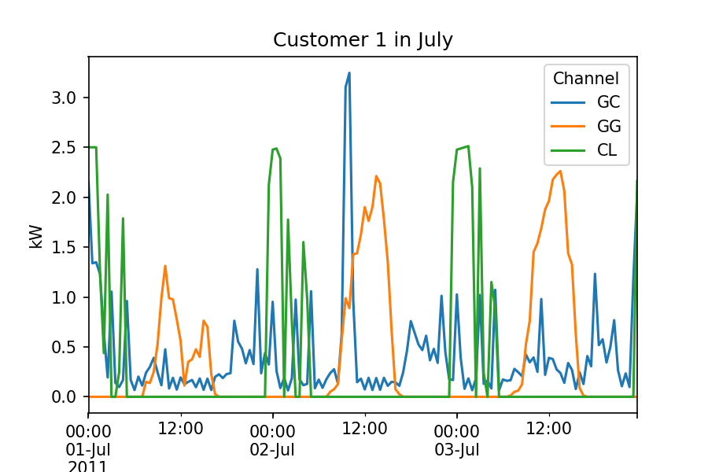
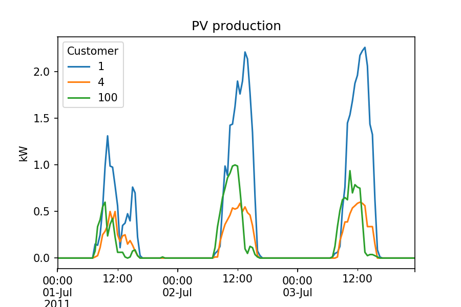
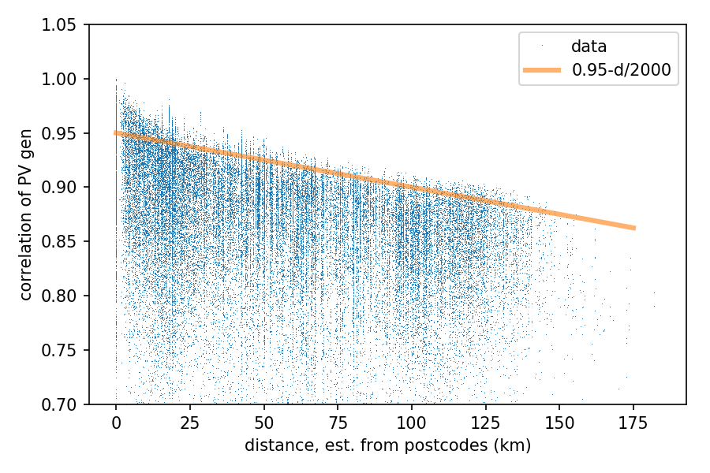
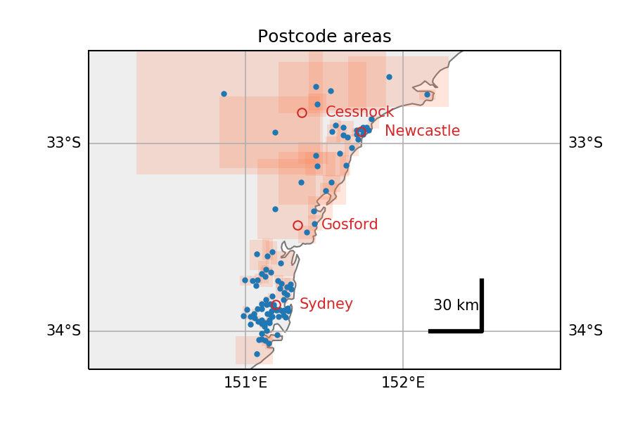

# Ausgrid - Solar home electricity data

Personal repository on the analysis of the [Solar home electricity dataset](http://www.ausgrid.com.au/Common/About-us/Corporate-information/Data-to-share/Solar-home-electricity-data.aspx),
made available by [Ausgrid](http://www.ausgrid.com.au/)
(an Australian electric utility which owns and operates the distribution grid
in Sidney and nearby areas in New South Wales, cf. their [network area map](https://www.ausgrid.com.au/network_area)).

## Dataset exploration

The dataset if quite rich, with records from 300 customers, with 2-3 channels for each customer:

1. "GG": PV production
2. "GC": electricity consumption
3. "CL": offpeak-controlled consumption (for some customers only).

Preliminary exploration is in [Solar home exploration.ipynb](Solar home exploration.ipynb). This notebook includes:

* how to read the orginal csv yearly files
* how to reshape the data in nicer "timeseries-friendly" format:

  * columns are customer/channel (using `pandas.MultiIndex`)
  * rows are the records for each datetime (regular sampling every 30 minutes)

### Slicing the dataset

Thanks to this (not so trivial) reshaping, it gets easy to access slices of the data (cf. code in the notebook).

* Slicing example 1: all the three measurement channels for a given customer:

* Slicing example 2: extract the PV production channel for a set of customers (here 3 randomly chosen customers):

### Dataset statistics

Finally, the notebook contains many statistics about the production (e.g. yield of PV production), the consumption ("size" of the customers), and the correlation of those. Main stats:

* Most PV systems are between 1 and 2 kWp (80 %). Biggest is 10 kWp
* Peak consumption of each customer is between 3 and 11 kW. Biggest is 15 kW. The energy to peak load ratio is between 600 and 1300 hours/year (average 1000 h). A few above 1500 h/y.

A crude attempt to relate the correlation of PV production accross sites as a function of distance is also provided:

### Postcode location

The location of each record is given by a postcode only.
To enable quantitative study of the spatiotemporal pattern in PV production,
I've tried to locate this postcodes.
Notebook [Postcodes location.ipynb](./Postcodes location.ipynb) contains
Python code to locate these postcodes.
It uses [Google Maps Geocoding API](https://developers.google.com/maps/documentation/geocoding/start).
Map plotting is done with [cartopy](http://scitools.org.uk/cartopy/).

The result of this location analysis is stored in the CSV table [postcodes.csv](postcodes/postcodes.csv).

Extracted from this notebook, here is an overview of the locations of the postcodes present in the dataset (in Australia, NSW).
Red rectangles are the boundaries of each postcode, as returned by Google maps
(small in urban areas along the coast, gigantic otherwise):

## About the dataset

Solar home electricity dataset is available as 4 zip archives, 60 MB in total.
See download links below.
Also, each archive contains additional notes about the data.

*Dataset description text cited from Ausgrid [dataset webpage](http://www.ausgrid.com.au/Common/About-us/Corporate-information/Data-to-share/Solar-home-electricity-data.aspx),
accessed April 2017:*

> We are sharing solar home electricity data to help with analysis by
> research organisations, solar companies, government and regulators as
> well as other interested parties.

> The customers in these datasets have been de-identified and do not
> represent a statistically relevant sample of residential customers in
> the Ausgrid network area and have not undergone detailed checks for
> occupancy. Typically, households that install solar systems own their
> home and live in separate houses with the available roof space needed to
> install a solar power system, as opposed to apartments.

> If you have any inquiries about this data or would like to provide
> feedback, including how the data is being used by your organisation and
> how useful it is, please email
> [sharinginformation@ausgrid.com.au](mailto:sharinginformation@ausgrid.com.au).

### a) Solar home half-hour data

> The half-hour electricity data is for 300 homes with rooftop solar
> systems that are measured by a gross meter that records the total amount
> of solar power generated every 30 minutes.

> The data has been sourced from 300 randomly selected solar customers in
> Ausgrid’s electricity network area that were billed on a domestic tariff
> and had a gross metered solar system installed for the whole of the
> period from 1 July 2010 to 30 June 2013. The customers chosen had a full
> set of actual data for the period from 1 July 2010 to 30 June 2011,
> gathered through our meter reading processes. We also undertook some
> data quality checking and excluded customers on the high and low ends of
> household consumption and solar generation performance during the first
> year.

#### Download:

* 1 July 2012 to 30 June 2013:
  [20122013 Solar home electricity data v2.zip](http://www.ausgrid.com.au/%7E/media/Files/About%20Us/Sharing%20Information/20122013%20Solar%20home%20electricity%20data%20v2.zip), 15 MB, 64 MB unzipped.
* 1 July 2011 to 30 June 2012:
  [20112012 Solar home electricity data v2](http://www.ausgrid.com.au/%7E/media/Files/About%20Us/Sharing%20Information/20112012%20Solar%20home%20electricity%20data%20v2.zip), 15 MB, 64 MB unzipped.
* 1 July 2010 to 30 June 2011:
  [Ausgrid solar home electricity data 201011 new.zip](http://www.ausgrid.com.au/%7E/media/Files/About%20Us/Sharing%20Information/Ausgrid%20solar%20home%20electricity%20data%20201011%20new.zip), 15 MB, 64 MB unzipped.

### b) Solar home monthly data

> The monthly electricity data is for 2,657 solar homes with rooftop solar
> systems that have a gross metering configuration. Data is provided over
> the period from 1 January 2007 to 31 December 2014 and therefore
> includes periods of household electricity use before the solar system
> was installed. In addition, a dataset of 4,064 non-solar homes is
> provided over the same time period in order to compare electricity usage
> patterns between the two datasets.

#### Download:

* [Solar home monthly data  2007 to 2014.ZIP](http://www.ausgrid.com.au/%7E/media/Files/About%20Us/Sharing%20Information/Solar%20home%20monthly%20data%20%202007%20to%202014.ZIP), 15 MB, 70 MB unzipped
